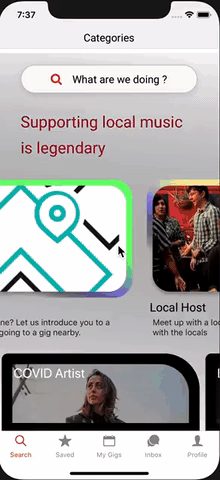
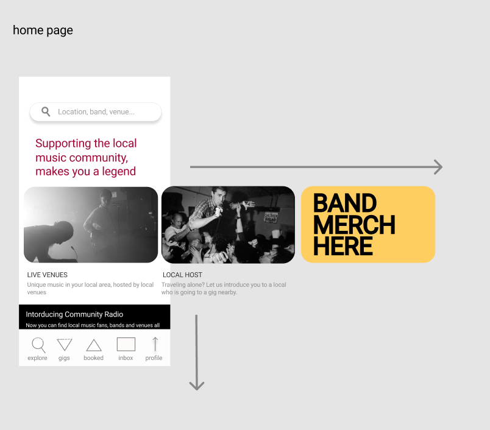

# Gig Guide 
## react native app expo

City of Melbourne is home of one of the worlds most thriving music scenes. I am keen to explore ways to help better equip musicians, venues and punters with react native mobile applications. 
 
<h2>Public User View</h2>

 
This project aims to explore the a basic landing page with screens for a public user looking at a local music scene. It uses react-native-expo, Redux, react navigation and dummy data (no database)
 
 

**Reflection on Learning**
 
 Redux state management is useful to hold the clients state of ‘favorites” and “filter settings”. The aesthetics are reasonable, however react-native expo handling with navigation stack looks unwieldy.

Navigation drawer and side menu feel outdated and lacks the flexibility. and I also thought I over did the colors for the UI.

I am hoping to make a sleeker looking application in a react-native-cli rebuild.  

 
<h2>Figma Layout Design</h2>

 

